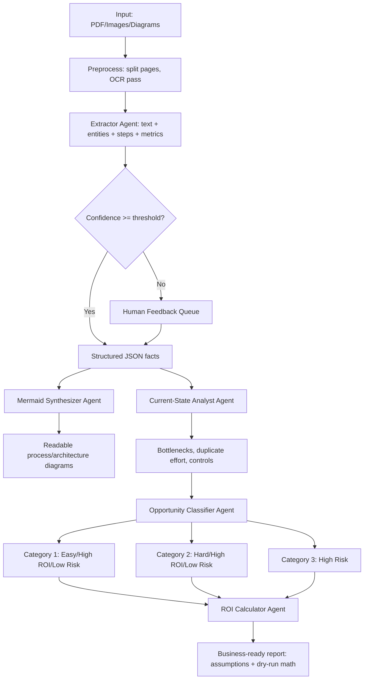

# Agentic AI Workflow Playbook (Local-First, Approval-Light)

## 1) Goal
Build a **repeatable agentic workflow** that can ingest large process/architecture diagrams (especially PDFs), extract only high-confidence facts, ask for human feedback when confidence is low, produce readable Mermaid diagrams, and propose practical automation options with explicit assumptions and ROI examples.

This playbook is designed for your current constraints:
- No cloud OCR/vision approvals yet.
- No managed vector DB (Faiss/cloud) for now.
- Single-user, office environment.
- Needs to work for check-processing flows **and** generic diagrams.

---

## 2) What You Can Build Right Now (No Cloud Dependencies)

### Core stack (local-first)
- **Python 3.10+**
- **OCR:** `ocrmypdf` + local `tesseract` (or `pytesseract`)  
- **PDF/table extraction:** `pdfplumber`, `pymupdf`, `camelot` (optional)
- **LLM orchestration:** GitHub Copilot + BMAD method prompts/workflow
- **Storage/retrieval:** local filesystem JSON + SQLite FTS (no vector DB needed initially)
- **Diagram output:** Mermaid files (`.mmd`) + Markdown reports

### Why this is enough
You can still get strong outcomes if you:
1. enforce confidence thresholds,
2. route uncertain content to human review,
3. keep all assumptions explicit,
4. version outputs so business users can trace changes.

---

## 3) Target End-to-End Flow

---

## 4) Agent Design (Minimal, Practical)

### Agent A: Document Ingestion & OCR Agent
**Input:** PDF, scanned docs, architecture images  
**Output:** page-wise extracted text + confidence metadata

Responsibilities:
- Detect if page is text-based or scanned.
- Run OCR only where needed.
- Save output per page:
  - `raw_text`
  - `ocr_confidence`
  - `unreadable_regions`

### Agent B: Process/Architecture Extraction Agent
**Input:** OCR/text chunks  
**Output:** normalized JSON facts

Extract:
- process steps (verb + object),
- handoffs (team/system A → B),
- controls/checkpoints,
- volumes/time/effort metrics,
- repeated steps/duplicate entries,
- systems and interfaces (for architecture diagrams).

Also attach confidence per extracted fact.

### Agent C: Human-in-the-Loop Agent
Rules:
- If confidence < threshold (e.g., 0.80), add item to `review_queue.md`.
- Ask specific clarifying questions, not generic ones.
- Keep unresolved items labeled `assumption_required`.

### Agent D: Diagram Synthesis Agent
Produce **chunked Mermaid** diagrams for readability:
- one high-level diagram,
- per-lane/per-subprocess diagrams,
- numbering to keep traceability (S1, S2...).

### Agent E: Current-State Diagnostics Agent
Outputs:
- bottlenecks,
- duplicated effort,
- unnecessary rework,
- manual handoffs,
- control risk points.

### Agent F: Opportunity & Risk Classifier Agent
Classify each recommendation into:
1. Easy + High ROI + Minimal risk,
2. Hard + High ROI + Minimal risk,
3. Very risky + high downside if wrong.

### Agent G: ROI & Business Report Agent
Produces business-readable report with:
- current pain,
- recommended agentic workflow,
- assumptions,
- dry-run ROI (single example),
- implementation roadmap.

---

## 5) Confidence & Feedback Policy (Important)

Use deterministic rules so output quality is trustworthy:

- `confidence >= 0.90`: auto-accept
- `0.80 <= confidence < 0.90`: accept but mark as “review suggested”
- `confidence < 0.80`: mandatory human validation
- unreadable/ambiguous blocks: do **not hallucinate**; ask reviewer

Template for questions:
1. “Step label unclear on page 8 near top-right: is it ‘CAR/LAR reject repair’?”
2. “Volume value appears as 12,000 or 72,000—please confirm.”

---

## 6) Output Format You Asked For (Business-Friendly)

For each run generate:

1. `01_current_state_summary.md`
2. `02_mermaid_high_level.mmd`
3. `03_mermaid_detailed/*.mmd`
4. `04_assumptions_log.md`
5. `05_recommendations_by_risk.md`
6. `06_roi_dry_run.md`
7. `review_queue.md`

Suggested recommendation table:

| ID | Recommendation | Category | ROI Driver | Risk if Wrong | Dependencies | Confidence |
|---|---|---|---|---|---|---|
| R1 | Auto-classify exception reasons | Easy/High ROI/Low Risk | Less manual triage time | Low | Historical labels | 0.86 |

---

## 7) Example: Agentic Opportunities for Check Processing

### Category 1: Easy + High ROI + Minimal Risk
- Exception ticket summarization agent.
- Duplicate-work detection agent (same check reviewed in multiple queues).
- Daily variance alerting agent (volume spikes by channel: ATM/QD/Lockbox/ICL).

Why low risk: mostly advisory, human keeps final decision.

### Category 2: Hard + High ROI + Minimal Risk
- End-to-end orchestration agent that suggests queue balancing across channels.
- Document intelligence agent that links incoming image quality issues to downstream rejects.

Harder due to integration complexity, not decision risk.

### Category 3: Very Risky (High downside if wrong)
- Fully autonomous pay/no-pay or return decisioning without human oversight.
- Autonomous funds availability or exception release decisions.

Risk: financial/regulatory/reputation impact.

---

## 8) Single Dry-Run ROI Example (With Assumptions)

Assumptions (explicit):
- 100,000 items/day across channels.
- 4.0% go to manual exception handling.
- Current handling time = 3.5 min/item.
- Agentic assist reduces handling time by 25%.
- Loaded labor cost = $42/hour.
- 250 workdays/year.

Calculation:
1. Manual items/day = 100,000 × 4.0% = 4,000
2. Time saved/item = 3.5 × 25% = 0.875 min
3. Total minutes saved/day = 4,000 × 0.875 = 3,500 min
4. Hours saved/day = 3,500 / 60 = 58.33 hours
5. Daily value = 58.33 × $42 = $2,449.86
6. Annual value = $2,449.86 × 250 = **$612,465**

If annual run cost is $120,000, then:
- Net benefit = $612,465 − $120,000 = **$492,465**
- ROI = Net benefit / Cost = 4.10x (410%)

---

## 9) Local Storage Strategy Without Vector DB

For single-user mode:
- Keep extracted chunks in `data/chunks/*.json`.
- Maintain lightweight index in `data/index.sqlite` using SQLite FTS5.
- Keep run metadata in `runs/<timestamp>/`.

This gives you:
- searchable history,
- reproducibility,
- zero external approvals.

You can upgrade later to Faiss/enterprise vector DB with minimal redesign.

---

## 10) Implementation Roadmap (2–4 Weeks)

### Phase 1 (Week 1): Foundations
- Folder structure + run manifests
- OCR + extraction + confidence scoring
- review queue generation

### Phase 2 (Week 2): Diagram + diagnostics
- Mermaid generation (high-level + chunked detail)
- bottleneck & duplication detection

### Phase 3 (Week 3): Recommendations + ROI
- category classifier
- ROI calculator
- business report template

### Phase 4 (Week 4): Hardening
- calibration of thresholds
- sample UAT with 2–3 real documents
- baseline vs assisted comparison

---

## 11) BMAD + Copilot Prompting Pattern

Use this execution sequence with BMAD-style disciplined prompting:

1. **Analyst mode prompt**: “Extract only explicit facts; attach confidence; no inference unless marked assumption.”
2. **Reviewer mode prompt**: “List ambiguities and ask targeted questions.”
3. **Architect mode prompt**: “Generate chunked Mermaid preserving step IDs and lane ownership.”
4. **Strategist mode prompt**: “Propose recommendations mapped to 3 risk categories.”
5. **Finance mode prompt**: “Show ROI math step-by-step and call out assumptions.”

---

## 12) Non-Negotiable Guardrails

- No autonomous high-impact financial decisions in early phases.
- Every low-confidence extraction must be visible in review queue.
- Every recommendation must include:
  - expected benefit,
  - risk rating,
  - fallback/manual override.
- Every ROI number must include formula and assumptions.

---

## 13) Reusable Report Skeleton

Use this structure in each final report:

1. Executive Summary
2. Scope and Source Documents
3. Current-State Workflow (Mermaid + narrative)
4. Pain Points (bottlenecks, duplication, delays)
5. Proposed Agentic Workflow
6. Recommendations by Category (1/2/3)
7. Assumptions Register
8. ROI Dry Run (with formulas)
9. Risks, Controls, and Human Oversight
10. 30-60-90 Day Rollout Plan

